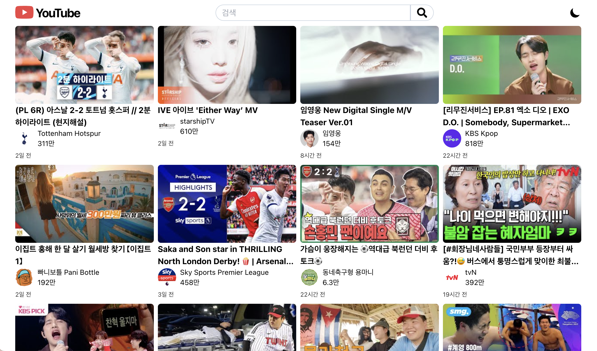
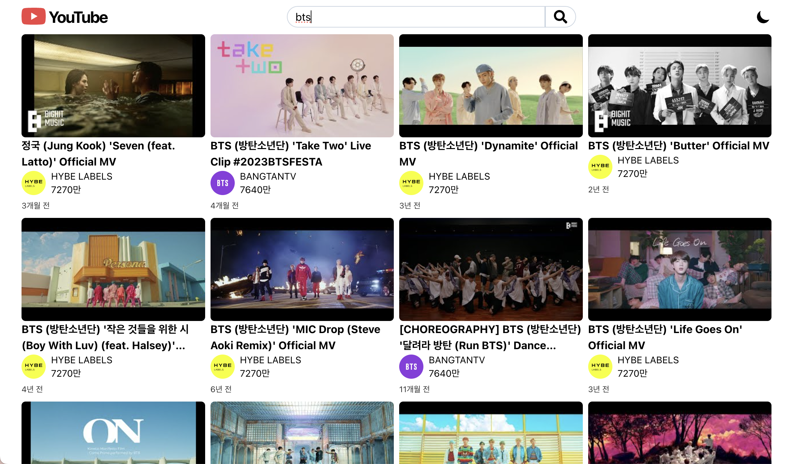
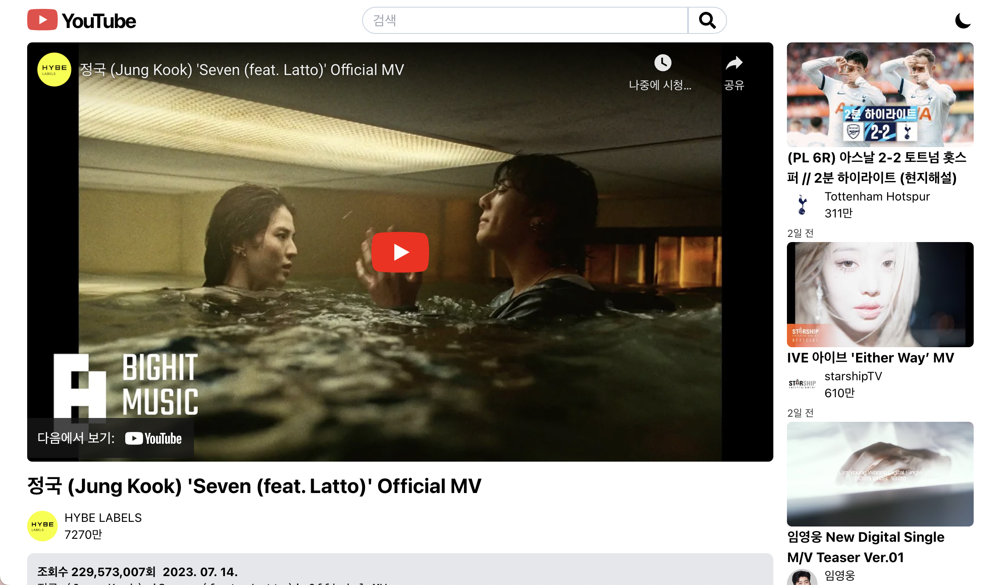
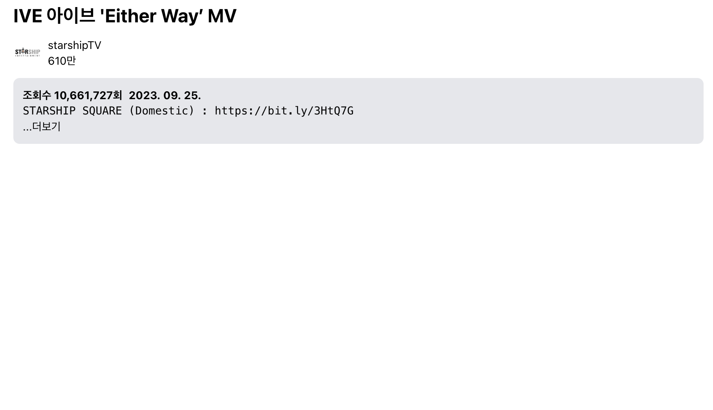
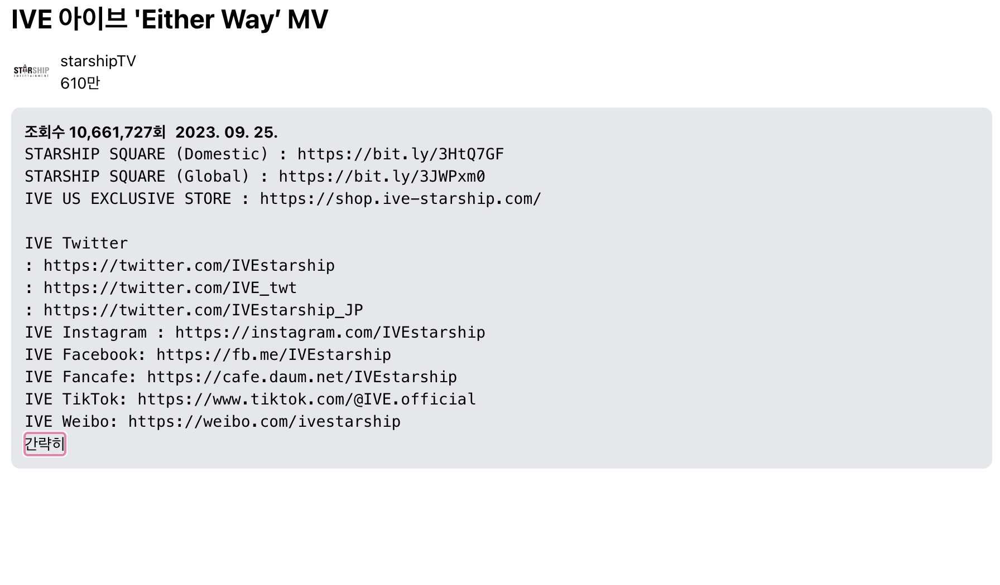
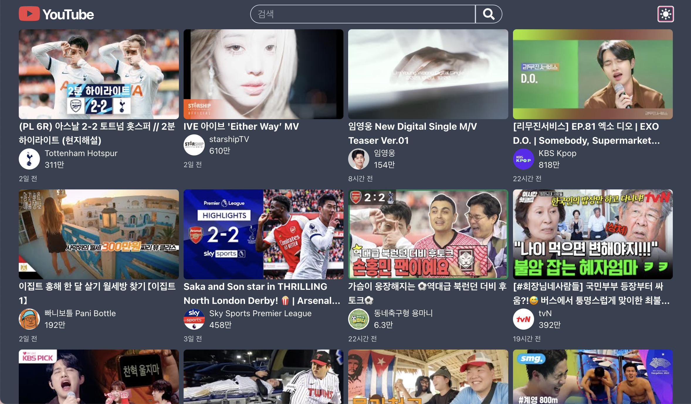

# React를 이용한 YOUTUBE Clone

  
  

## 주요기능

1. 유튜브 API 활용
2. 인기 동영상 목록 보기
3. 키워드로 동영상 검색
4. Tailwind CSS로 구현한 반응형 웹 페이지
5. 라이트 모드 / 다크 모드 테마
6. 로컬스토리지에 테마 저장하여 기억

## 기술 스택

 

## 스크린샷

1. 메인 페이지 
    
2. 검색 페이지 
    
3. 동영상 클릭 후 표시되는 화면
    
4. 동영상의 자세한 정보는 더보기, 간략히 보기 가능
    
    
5. 반응형 웹 페이지
    
    
6. 라이트 모드 / 다크모드 테마 : 사용자의 브라우저 초기 설정값을 따라가도록 설정
    
    
